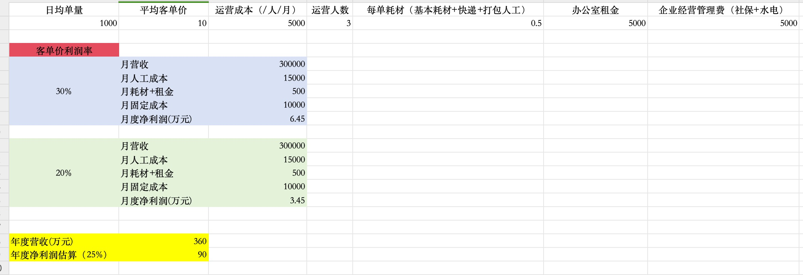

# 2024 ROADMAP

2024 创业路书。

## 目标

- 团队规模 4~6 人
- 稳定运营 TEMU SHEIN EMAG 三个平台
- 24年总营收 300w、净利润 60w (期初投入控制在 10~20w)

目标的制定参考了下述样本：

该样本为 TEMU 平台，3 个月左右做到日均 1000 单的体量，分三个账号经营，每个账号一个运营人员，基本人效比为 300 单/人/天。

TEMU 的商业模式可以抽象成：平台 -> 贸易商(自己) -> 实际供应商

目前该平台的经营模式还是可复制的，贸易商挣的利润实际来自下层员工：假设一个员工日均 300(单) * 10(客单价) * 30(天) * 25%(利润率) - 5000(工资) - 100(固定损耗)*30 = 1.45w

该模式是目前可行的商业模式，以此作为创业基本盘，同时外拓其他平台。

## ROADMAP

### Q2

季度关键词：***探索、组团队、做基本盘***

**4月**

- 寻求创业伙伴，人数控制在 2~4 人
- 摸清 TEMU SHEIN EMAG 三个平台的操作流程（商业模式）
- 确定合作伙伴，注册新公司，为后续商业模式的复制做准备
- 寻求办公场地：容纳 4~6 人办公、同时能提供仓储打包的功能 （预算5000-6000元）

**5月**

- 入驻布置场地，开始正常公司经营
- 将 TEMU 的商业模式进行复制，保证基本营收
- 日均 500 单

**6月**

- 提升 TEMU 平台产出：日均 1000 单
- 发力 SHEIN 平台，做到日均 200 单
- 探索 EMAG 平台，挖掘新的营收点

### Q3

季度关键词：***稳根基、新平台、新增长***

**7月**

- 招新人进行 TEMU 基本盘的日常运营
- 重点投入到 SHEIN 平台的增长目标上(日均 1000 单)
- 为 emag 平台进行选品，以及新品发布上架

**8月**

- 引入新人对 SHEIN 平台进行日常运营
- 重点投入到 emag 平台的运营探索

**9月**

- 季度复盘，稳固现有平台流量
- emag 平台进入稳定运营期

### Q4

季度关键词：***复制、总结、规划***

**10月**

- 持续稳定经营
- 商业模式总结、如何复制

**11月**

- 复制商业模式
- 探索新的平台、新的增长点

**12月**

- 年度营收、成本统计
- 新年规划
